<p align="center">
  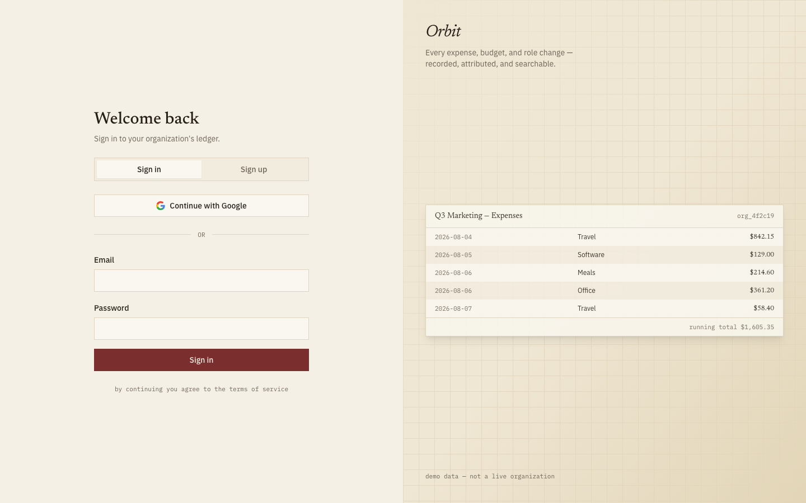
</p>

<h1 align="center">Orbit</h1>
<p align="center">
  A team expense &amp; budget tracker with real multi-tenancy, RBAC, and an audit trail —
  the capstone of a five-project portfolio series.
</p>

---

Orbit is a full-stack SaaS product, not a CRUD demo. The interesting part was never
"add an expense" — it's that every read and write is scoped to an organization and a
role at the data-access layer, enforced server-side, and provable: this repo ships
tests that try to break that boundary on purpose (a tampered org ID via direct URL, a
raw data-layer call bypassing the UI entirely, a Member attempting an Admin-only
mutation) and confirms each one is rejected.

## Contents

- [Screenshots](#screenshots)
- [Feature tour](#feature-tour)
- [Tech stack](#tech-stack)
- [Architecture](#architecture)
- [Schema](#schema)
- [RBAC permission matrix](#rbac-permission-matrix)
- [Auth flow](#auth-flow)
- [Security](#security)
- [Why Auth.js](#why-authjs-not-clerk-or-supabase-auth)
- [Getting started](#getting-started)
- [Testing](#testing)
- [Known fixes](#known-fixes-found-during-real-testing)
- [Deployment](#deployment)
- [Portfolio series](#part-of-a-portfolio-series)

## Screenshots

Every screenshot below is the real app running against seeded demo data — not
mockups.

### Sign in / sign up

The first thing anyone sees. A split layout: the actual auth form on the left, a
softly-blurred preview of the real ledger UI on the right, so a visitor gets an
honest taste of the product before signing in.

<p align="center">
  
  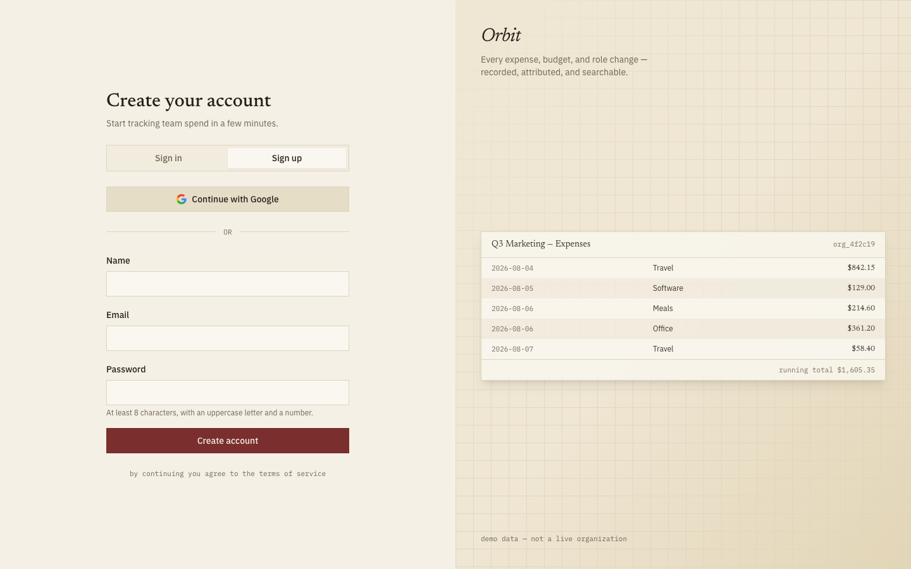
</p>

### Dashboard — Owner / Admin view

The full finance suite: 8 KPI tiles (with inline sparklines and month-over-month
deltas), a budget-utilization meter, a "biggest movers vs. last period" panel, 6
charts, a dense category breakdown table, top expenses, and a live activity feed —
all scoped by the period + category filter bar at the top.

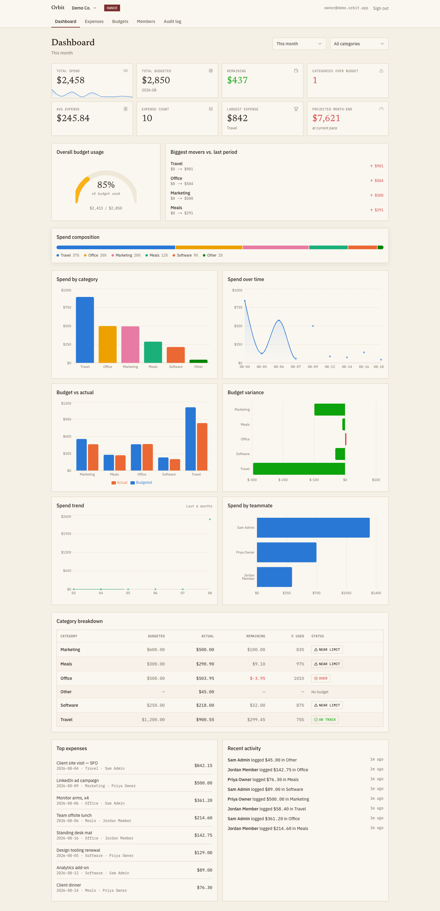

### Dashboard — Member view

Deliberately narrower. A Member sees their own spend and recent activity, plus
org-wide budget context to plan around — never a spend-by-colleague leaderboard,
which is an Admin/Owner-only view.

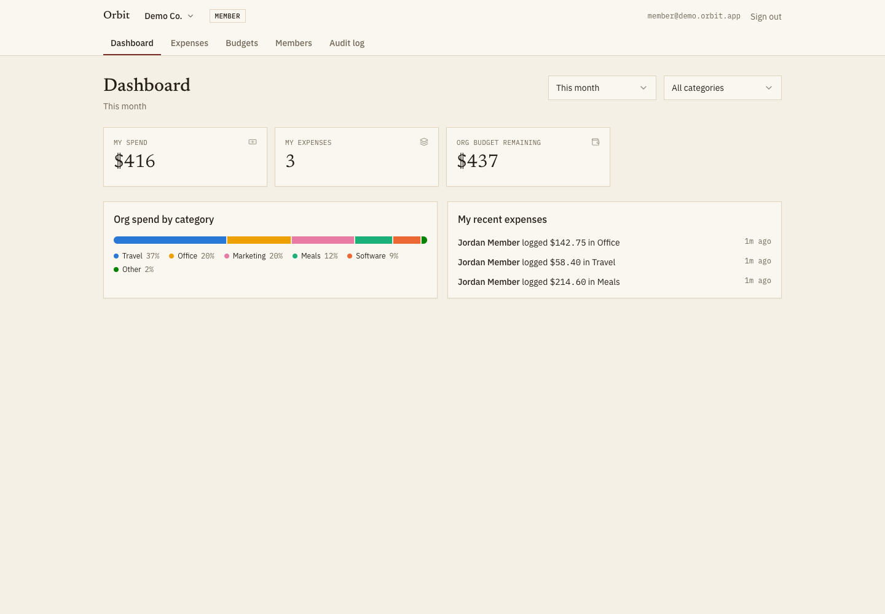

### Expenses

A real ledger, not a generic data table: alternating row shading, right-aligned
tabular figures, and a running-total column that accumulates chronologically even
though the list displays newest-first.

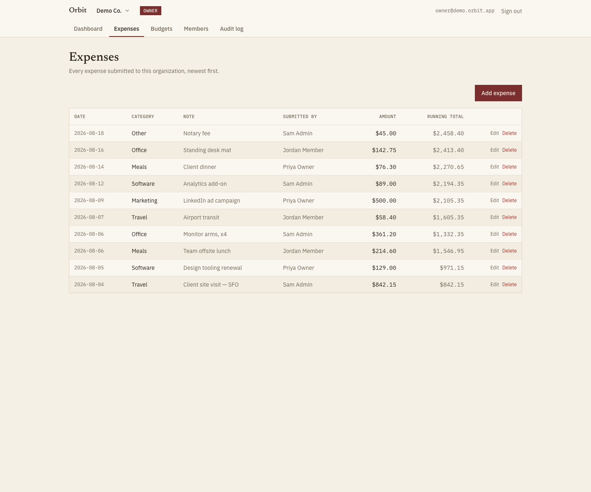

### Budgets

Per-category, per-month budgets measured against actual spend, with a status badge
(on track / near limit / over budget) that's never color alone — always an icon and
a label too.

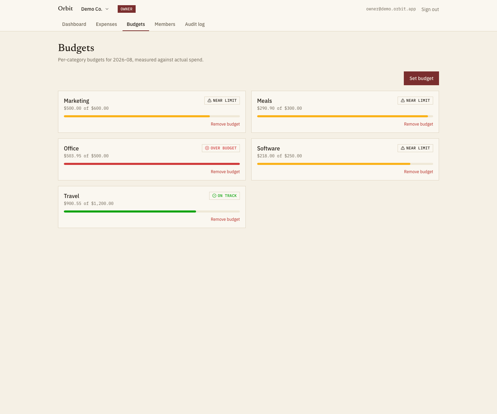

### Members

Invite by email with a role attached to the invite itself. Role-change and
member-removal controls are permission-gated in the UI *and* rejected server-side if
someone tries to force them anyway — the screenshots below prove the second half.

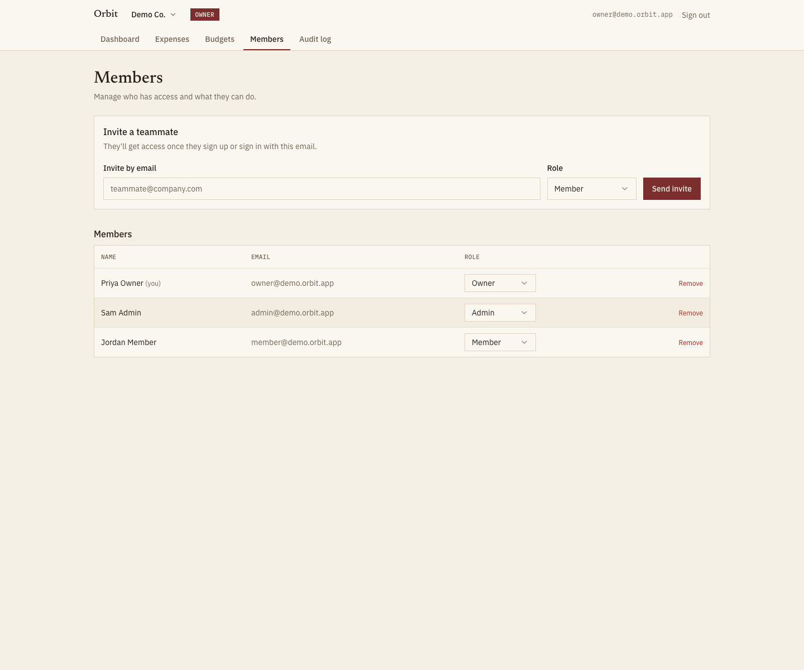

### Audit log

Filterable by action type, not a raw table dump. Every meaningful mutation — role
changes, member removal, budget edits, org creation, invites — lands here with the
actor, the timestamp, and a human-readable detail column.

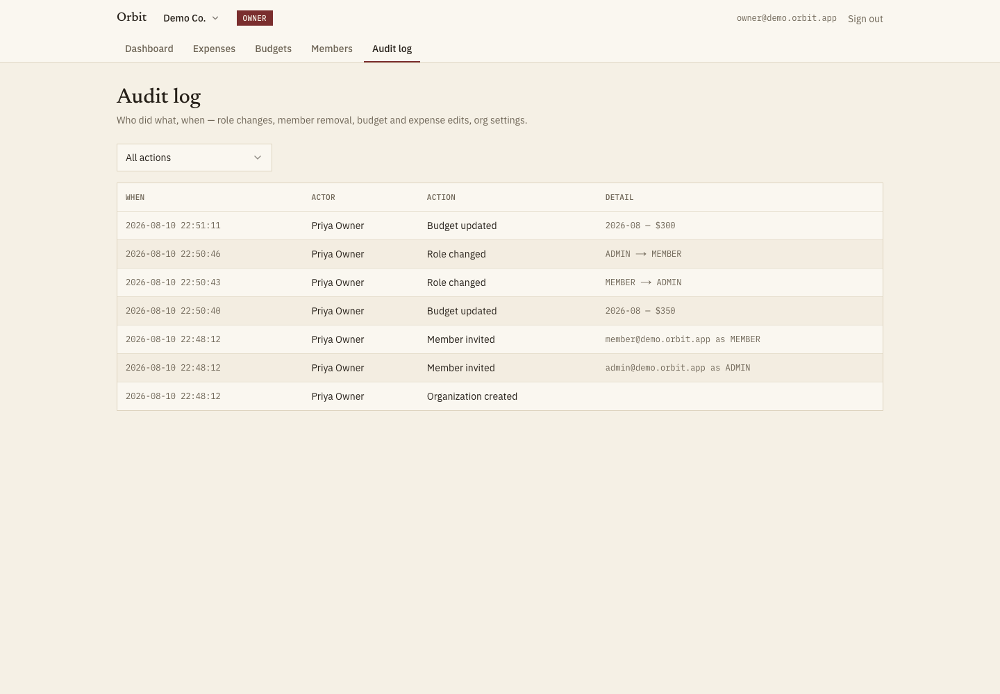

## Feature tour

- **Sign up / sign in** — credentials (bcrypt-hashed passwords, email verification
  via a real Resend send) and Google OAuth, both landing on the same session model.
- **Organizations** — create one, or accept an invite into an existing one. An
  account can belong to more than one org; an org switcher in the nav handles it.
- **Invites** — Admin/Owner invites by email with a role attached to the invite
  itself (not the inviter's role). A real email sends with a link that carries the
  recipient through sign-in and back to a real "Accept invite" action.
- **Expenses** — amount, category, date, note, submitted-by. Anyone can create one;
  editing/deleting someone *else's* expense requires Admin or Owner.
- **Budgets** — per category, per month, with status derived from actual spend.
- **Dashboard** — real aggregation queries (not client-side math over an
  over-fetched list): spend by category, spend over time, budget vs. actual,
  6-month trend, spend variance, spend by teammate, a budget-utilization meter, and
  a biggest-movers panel — filterable by period and category, all server-rendered.
- **Members & roles** — Owner / Admin / Member, with the actual boundaries enforced
  at the data layer (see [RBAC permission matrix](#rbac-permission-matrix)).
- **Audit log** — every meaningful mutation recorded with actor, action, target,
  and metadata; filterable by action type in the UI.
- **Rate limiting** — auth endpoints are rate-limited against brute force (Upstash
  Redis), with a test that actually trips it, not just asserts the code exists.

## Tech stack

| Layer | Choice |
|---|---|
| Framework | Next.js 14 (App Router), TypeScript strict, zero `any` |
| Database | PostgreSQL via Prisma |
| Auth | Auth.js (NextAuth v5) — credentials + Google OAuth |
| Styling | Tailwind CSS + hand-rolled Radix-based primitives (not default shadcn look) |
| Validation | Zod — one schema per form, shared between client and server |
| Charts | Recharts, styled to a validated categorical/status palette |
| Rate limiting | Upstash Ratelimit (Redis-backed) |
| Email | Resend |
| Testing | Playwright (E2E) + a standalone data-layer security check |

## Architecture

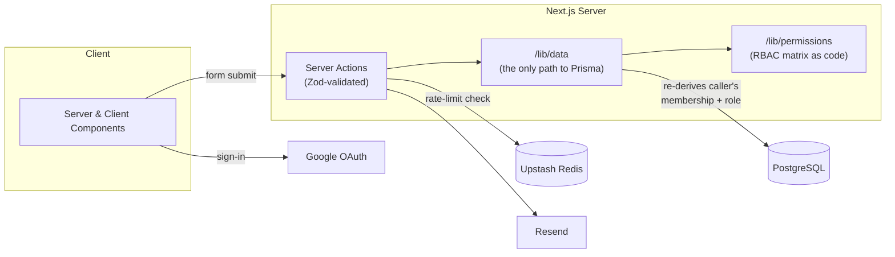

The rule that makes the tenancy tests pass: **components never import Prisma
directly.** Every read and write goes through `/lib/data`, and every function in
there takes the caller's `userId` and the target `orgId` as separate arguments and
re-derives the membership/role from the database on every call — it never trusts a
role or org claim from the client, the session, or a previous call in the same
request. That's what makes "call the function directly with a forged org ID" fail
correctly (see [Security](#security)).

## Schema

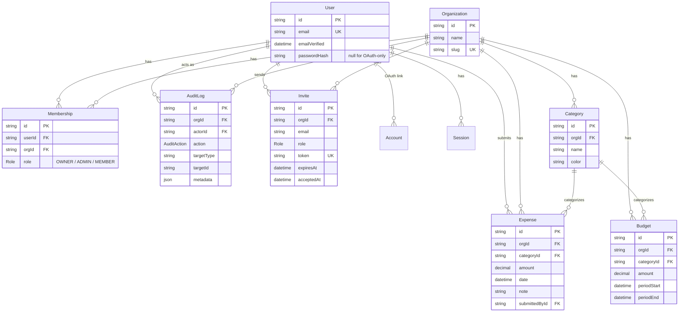

`User`/`Account`/`Session`/`VerificationToken` are Auth.js's required adapter
tables — see [Why Auth.js](#why-authjs-not-clerk-or-supabase-auth) for why they live
in this same Postgres database rather than a hosted auth provider.

One thing not visible in the diagram: `User.email` has a case-insensitive unique
index (`lower(email)`) added via a raw-SQL migration, alongside Prisma's normal
case-sensitive `@unique` — see [Known fixes](#known-fixes-found-during-real-testing).

## RBAC permission matrix

| Action | Owner | Admin | Member |
|---|:---:|:---:|:---:|
| View dashboard / reports | ✅ | ✅ | ✅ |
| Create expense | ✅ | ✅ | ✅ |
| Edit / delete **own** expense | ✅ | ✅ | ✅ |
| Edit / delete **any** expense | ✅ | ✅ | ❌ |
| Create / edit / delete budget | ✅ | ✅ | ❌ |
| Invite member (as Member or Admin) | ✅ | ✅ | ❌ |
| Invite member (as Owner) | ✅ | ❌ | ❌ |
| Revoke pending invite | ✅ | ✅ | ❌ |
| Change role: Member ↔ Admin | ✅ | ✅ | ❌ |
| Change role: touching an Owner | ✅ | ❌ | ❌ |
| Remove member (Member or Admin) | ✅ | ✅ | ❌ |
| Remove member (Owner) | ✅ (self only, never the last Owner) | ❌ | ❌ |
| Edit org settings | ✅ | ✅ | ❌ |
| Delete organization | ✅ | ❌ | ❌ |
| View audit log | ✅ | ✅ | ❌ |

The nuance that isn't obvious from a flat table: an **Admin is a real "manage the
team" role**, not just "Member+". Admins can invite, re-role, and remove other
Members and Admins, edit budgets, and read the audit log — but they can never touch
an Owner's membership, invite someone in *as* an Owner, delete the org, or leave it
with zero Owners. That boundary — Admin stops exactly at Owner — is what the
role-boundary E2E test exercises.

This table is implemented as code, not just documentation, in
[`src/lib/permissions.ts`](src/lib/permissions.ts) — every mutation in
`/lib/data` calls into it instead of re-deriving its own role logic.

## Auth flow

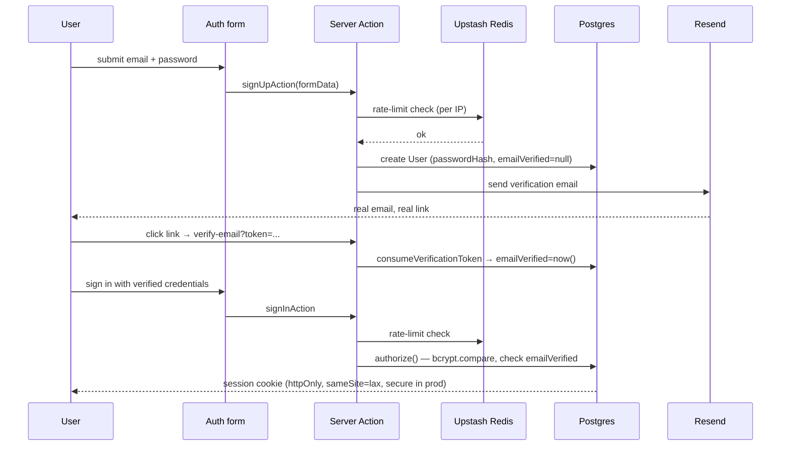

Google OAuth follows the same rate-limited entry point but skips verification
(Google already verified the email). Both paths converge on the same JWT session
and the same `requireUser()` guard on every server component/action.

## Security

Non-negotiable, and demonstrated rather than just asserted:

- **All authorization is server-side.** The client is assumed hostile. Every
  `/lib/data` function re-derives the caller's membership and role from the
  database — it is structurally impossible for a mutation to succeed against an org
  the caller isn't a member of, regardless of what a form field, a URL segment, or a
  tampered request claims.
- **Proven three independent ways**, not just by code review:
  1. `e2e/cross-org-isolation.spec.ts` — a real browser session, signed in as Org
     A's owner, is driven to Org B's dashboard/expenses/members/audit-log URLs
     directly. Confirms the response never contains Org B's data and Org B's data
     is untouched in the database afterward.
  2. `e2e/role-boundary.spec.ts` — confirms a Member is server-side blocked from
     Admin-only actions (not just UI-hidden from them), and that an Admin in the
     *same* org correctly sees the controls a Member doesn't.
  3. `e2e/tenancy-data-layer-check.mjs` — the most literal version of "a raw call
     with a tampered org ID must be rejected": bypasses the browser and HTTP
     entirely and calls the actual `/lib/data` functions directly with a
     forged `orgId`, confirming rejection at the source. Run with:
     ```bash
     pnpm exec tsx --conditions=react-server e2e/tenancy-data-layer-check.mjs
     ```
- **CSRF & cookies** — Auth.js's built-in CSRF protection; session cookies are
  `httpOnly`, `sameSite=lax`, and `secure` in production.
- **Rate limiting** — `e2e/rate-limit.spec.ts` runs 6 real sign-in attempts against
  a real Redis instance and confirms the 6th is blocked *before* it reaches
  `authorize()`.
- **No secrets client-side** — `NEXT_PUBLIC_APP_URL` is the only `NEXT_PUBLIC_`
  variable in the app; it's used to build absolute links (invite URLs) and carries
  no secret material. Everything else stays server-only, enforced by the `"server
  only"` import guard on every `/lib/data` and `/lib/env` module.
- **SQL injection impossible by construction** — every query goes through Prisma's
  parameterized query builder; there is no raw SQL in the application code path
  (the one raw-SQL migration, for a case-insensitive email index, runs once at
  migration time, not per-request, and contains no user input).
- **Env validation at boot** — `src/lib/env.ts` validates every required variable
  with Zod at startup; a missing secret fails loudly and immediately, not on the
  first request that happens to need it.

## Why Auth.js, not Clerk or Supabase Auth

All three are reasonable choices; here's the actual tradeoff.

**Clerk** has the best out-of-box developer experience — prebuilt UI, a hosted user
dashboard, webhooks for everything. The cost is that user data lives in Clerk's
system, not this app's Postgres: joining a Clerk user against an `orgId` and a
`role` (the entire point of this project) means syncing Clerk's user records into
your own database via webhooks, and now there are two sources of truth for "who is
this user" instead of one. For an app whose core feature *is* the relational model
between users, orgs, and roles, that split is the wrong shape.

**Supabase Auth** is a strong choice if you're already on Supabase's Postgres and
client SDK — but this project deliberately used vanilla Postgres via Prisma so it
can run against any host (local, Neon, Supabase's own Postgres, whatever), and
Supabase Auth's session/user model is designed to pair with Supabase's own client
libraries, not to be an arbitrary adapter target for a Prisma schema you fully
control.

**Auth.js**, via its Prisma adapter, puts `User`/`Account`/`Session` in the exact
same database and the exact same migration history as `Organization`/`Membership`/
`Expense`. RBAC checks are a single Prisma query away from the session's user ID —
no cross-service joins, no webhook sync lag, no second source of truth. The cost is
real: email verification, rate limiting, and session cookie configuration are things
Clerk gives you for free that this project built by hand. For an app whose whole
point is demonstrating that the *data model* enforces the security boundary, owning
that plumbing was the right trade.

## Getting started

### Prerequisites

- Node 20+, [pnpm](https://pnpm.io)
- A local PostgreSQL instance (or a connection string to a hosted one)
- A local Redis instance for rate-limiting in dev (see below)

### 1. Install and configure

```bash
git clone https://github.com/Aryantyagi-2003/Orbit.git
cd Orbit
pnpm install
cp .env.example .env
```

Fill in `.env`:

| Variable | Where to get it |
|---|---|
| `DATABASE_URL` | Your Postgres connection string |
| `AUTH_SECRET` | `openssl rand -base64 32` |
| `GOOGLE_CLIENT_ID` / `GOOGLE_CLIENT_SECRET` | See [Google OAuth setup](#google-oauth-setup) below |
| `RESEND_API_KEY` | [resend.com](https://resend.com) → API Keys |
| `EMAIL_FROM` | An address on a domain verified in Resend |
| `UPSTASH_REDIS_REST_URL` / `UPSTASH_REDIS_REST_TOKEN` | [upstash.com](https://upstash.com) console, or the local shim below |
| `NEXT_PUBLIC_APP_URL` | `http://localhost:3000` in dev |

#### Google OAuth setup

1. [Google Cloud Console](https://console.cloud.google.com) → create/select a
   project → **APIs & Services → OAuth consent screen** → configure it (External,
   fill in the app name/support email).
2. **APIs & Services → Credentials → Create Credentials → OAuth client ID** → type
   **Web application**.
3. Under **Authorized redirect URIs**, add:
   `http://localhost:3000/api/auth/callback/google` (and your production URL's
   equivalent once deployed).
4. Copy the generated Client ID and Client Secret into `.env`.

#### Local Redis for rate limiting

Production points at real Upstash. Locally, either:

```bash
docker compose -f docker-compose.dev.yml up -d
```

or, without Docker:

```bash
redis-server --daemonize yes
node scripts/dev-redis-http-shim.mjs
```

(the shim speaks just enough of the Upstash REST protocol to satisfy
`@upstash/ratelimit` against a real local Redis — see the file for why).

### 2. Database

```bash
pnpm exec prisma migrate deploy
pnpm run db:seed
```

The seed script creates a demo organization (`Demo Co.`) with three members across
all three roles, ten realistic expenses, and five category budgets — so the app has
real content on first view instead of an empty state:

| Role | Email | Password |
|---|---|---|
| Owner | `owner@demo.orbit.app` | `DemoPassword9!` |
| Admin | `admin@demo.orbit.app` | `DemoPassword9!` |
| Member | `member@demo.orbit.app` | `DemoPassword9!` |

### 3. Run it

```bash
pnpm dev
```

Open [http://localhost:3000](http://localhost:3000) and sign in with one of the
seeded accounts above, or create your own.

## Testing

```bash
pnpm exec playwright test                                              # full E2E suite
pnpm exec tsx --conditions=react-server e2e/tenancy-data-layer-check.mjs  # data-layer security check
pnpm exec tsc --noEmit                                                  # typecheck
pnpm run lint                                                           # ESLint
```

The E2E suite covers: cross-org isolation via direct URL, role-boundary enforcement
(Member vs. Admin, server-side, not just UI-hidden), and rate-limiter behavior
against a real Redis instance.

## Known fixes (found during real testing)

Kept visible on purpose — these were real bugs, found by actually exercising the
app rather than just reading the code, and are worth understanding if you're
extending this project.

- **Email case-sensitivity duplicate accounts.** Emails weren't normalized before
  storage/lookup, so `A@x.com` and `a@x.com` could create two `User` rows for the
  same person. Fixed by trimming + lowercasing at every write and lookup path (the
  shared Zod schema, the credentials queries, and the Google `profile()` mapping),
  plus a case-insensitive unique index on `lower(email)` as a database-level
  backstop independent of application code.
- **Invite flow was only half-built.** `createInvite()`/`acceptInvite()` existed in
  the data layer, but nothing sent an email and no page could call `acceptInvite()`
  — an invited user just landed on onboarding with no idea they'd been invited.
  Fixed with a real Resend send and a full `/invite/[token]` acceptance flow.
- **A Member's "recent expenses" could silently drop their own older items** —
  it filtered a Member's expenses out of the *org's* top-8-most-recent list, so
  enough other people's activity could push a Member's own expense off the list
  entirely. Fixed with a query scoped directly to that Member.
- **Chart hover backgrounds rendered solid black.** Root cause: several CSS custom
  properties (`--border`, `--accent`, `--card`, `--muted-foreground`) are stored as
  bare HSL triplets for Tailwind's `hsl(var(--x))` pattern, but the chart code used
  them as raw `var(--x)` directly in inline SVG fill/stroke props — invalid CSS,
  which SVG silently resolves to black for an invalid fill (and `none` for an
  invalid stroke, which is why gridlines had quietly stopped rendering at all).
  Fixed by wrapping every such reference in `hsl(...)`. Recharts' `RadialBar`
  `background` prop turned out not to resolve CSS custom properties under *any*
  format — fixed with a hardcoded hex kept in comment-sync with the token.

## Deployment

Not yet deployed live — the app is built and verified locally end-to-end (see
[Testing](#testing)) but hasn't been pushed to Vercel yet. Once deployed to Vercel +
Neon/Supabase Postgres, the live URL will be linked here and the E2E suite run
against it at least once.

## Part of a portfolio series

Orbit is the fifth and final project in a series, each one built to demonstrate a
different slice of full-stack engineering:

- **[Sift](https://github.com/Aryantyagi-2003/Sift)** — a RAG API.
- **[Pulse](https://github.com/Aryantyagi-2003/Pulse)** — a real-time WebSocket
  dashboard.
- **[Conduit](https://github.com/Aryantyagi-2003/Conduit)** — a data pipeline.
- **Orbit** (this repo) — a full-stack SaaS product: multi-tenancy, RBAC, and an
  audit trail, enforced at the data layer and proven with tests that try to break
  it.
